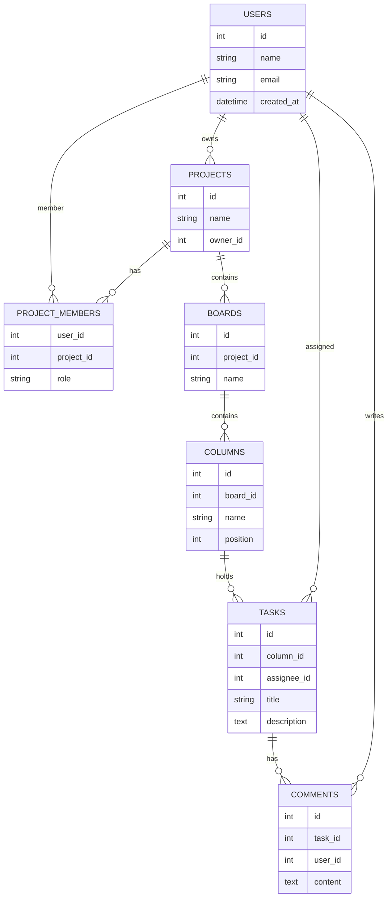

# Premium Kanban Application

A full-stack, state-of-the-art Kanban Project Management application built with Next.js 14, NestJS, and PostgreSQL.

## Features

- **JWT Authentication**: Secure user registration and login flow.
- **Projects & Workspaces**: Create, manage, and view distinct projects.
- **Interactive Boards**: Dedicated kanban boards per project structure.
- **Drag & Drop**: Fluid and resilient task management powered by `@hello-pangea/dnd`.
- **Beautiful UI**: Modern aesthetics featuring Tailwind CSS, glassmorphism, responsive design, and smooth layout animations.
- **Global State**: Client state synchronization driven by Zustand.

## Tech Stack
- **Frontend**: Next.js (App Router), React, TailwindCSS, Zustand, Axios
- **Backend**: NestJS, TypeORM, PostgreSQL, class-validator, Passport (JWT)
- **Deployment/Ops**: Docker Compose, GitHub Actions API

## Getting Started

### Prerequisites
- Node.js (v18+)
- Postgres 15+ (or use the provided Docker integration)
- Docker & Docker Compose (optional for local DB)

### 1. Database Setup
Spin up the local PostgreSQL database using Docker:
```bash
docker compose up -d
```

### 2. Backend Setup
```bash
cd backend
npm install
npm run seed  # Generates a demo user, project, and board
npm run start:dev
```
*API available at `http://localhost:3000/api` (Swagger Docs).*

### 3. Frontend Setup
```bash
cd frontend
npm install
npm run dev
```
*App available at `http://localhost:3001`.*

## Database Diagram (ERD)


---
